## 网段扫描
```
root@LingMj:~/xxoo# arp-scan -l
Interface: eth0, type: EN10MB, MAC: 00:0c:29:fb:0f:16, IPv4: 192.168.137.194
Starting arp-scan 1.10.0 with 256 hosts (https://github.com/royhills/arp-scan)
192.168.137.1	3e:21:9c:12:bd:a3	(Unknown: locally administered)
192.168.137.202	a0:78:17:62:e5:0a	Apple, Inc.
192.168.137.230	3e:21:9c:12:bd:a3	(Unknown: locally administered)

4 packets received by filter, 0 packets dropped by kernel
Ending arp-scan 1.10.0: 256 hosts scanned in 2.035 seconds (125.80 hosts/sec). 3 responded
```

## 端口扫描

```
root@LingMj:~/xxoo# nmap -p53,88,135,139,389,445,464,593,636,3268,3269,5985,9389,49664,49667,49677,49725 -sVC 192.168.137.230
Starting Nmap 7.94SVN ( https://nmap.org ) at 2025-07-30 23:47 EDT
Nmap scan report for DC01.mshome.net (192.168.137.230)
Host is up (0.0056s latency).

PORT      STATE SERVICE       VERSION
53/tcp    open  domain        Simple DNS Plus
88/tcp    open  kerberos-sec  Microsoft Windows Kerberos (server time: 2025-07-31 18:47:35Z)
135/tcp   open  msrpc         Microsoft Windows RPC
139/tcp   open  netbios-ssn   Microsoft Windows netbios-ssn
389/tcp   open  ldap          Microsoft Windows Active Directory LDAP (Domain: SOUPEDECODE.LOCAL0., Site: Default-First-Site-Name)
445/tcp   open  microsoft-ds?
464/tcp   open  kpasswd5?
593/tcp   open  ncacn_http    Microsoft Windows RPC over HTTP 1.0
636/tcp   open  tcpwrapped
3268/tcp  open  ldap          Microsoft Windows Active Directory LDAP (Domain: SOUPEDECODE.LOCAL0., Site: Default-First-Site-Name)
3269/tcp  open  tcpwrapped
5985/tcp  open  http          Microsoft HTTPAPI httpd 2.0 (SSDP/UPnP)
|_http-title: Not Found
|_http-server-header: Microsoft-HTTPAPI/2.0
9389/tcp  open  mc-nmf        .NET Message Framing
49664/tcp open  msrpc         Microsoft Windows RPC
49667/tcp open  msrpc         Microsoft Windows RPC
49677/tcp open  ncacn_http    Microsoft Windows RPC over HTTP 1.0
49725/tcp open  msrpc         Microsoft Windows RPC
MAC Address: 3E:21:9C:12:BD:A3 (Unknown)
Service Info: Host: DC01; OS: Windows; CPE: cpe:/o:microsoft:windows

Host script results:
|_clock-skew: 14h59m52s
| smb2-time: 
|   date: 2025-07-31T18:48:23
|_  start_date: N/A
| smb2-security-mode: 
|   3:1:1: 
|_    Message signing enabled and required
|_nbstat: NetBIOS name: DC01, NetBIOS user: <unknown>, NetBIOS MAC: 08:00:27:15:81:09 (Oracle VirtualBox virtual NIC)

Service detection performed. Please report any incorrect results at https://nmap.org/submit/ .
Nmap done: 1 IP address (1 host up) scanned in 94.54 seconds
```

## 获取webshell

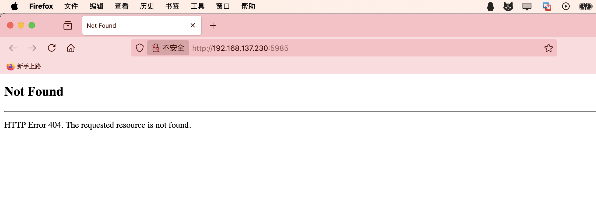  

>这个http没有东西
>

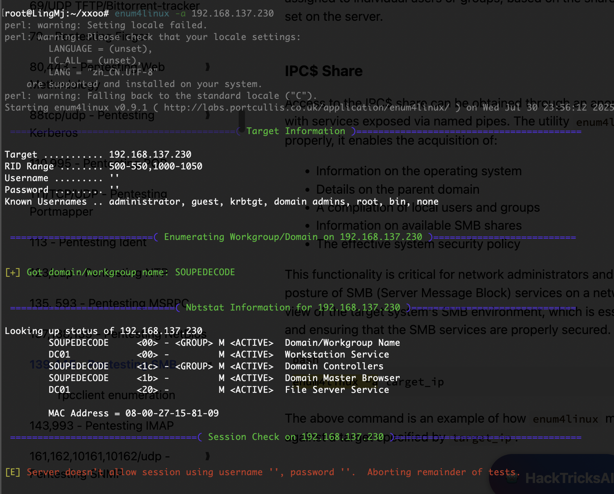  
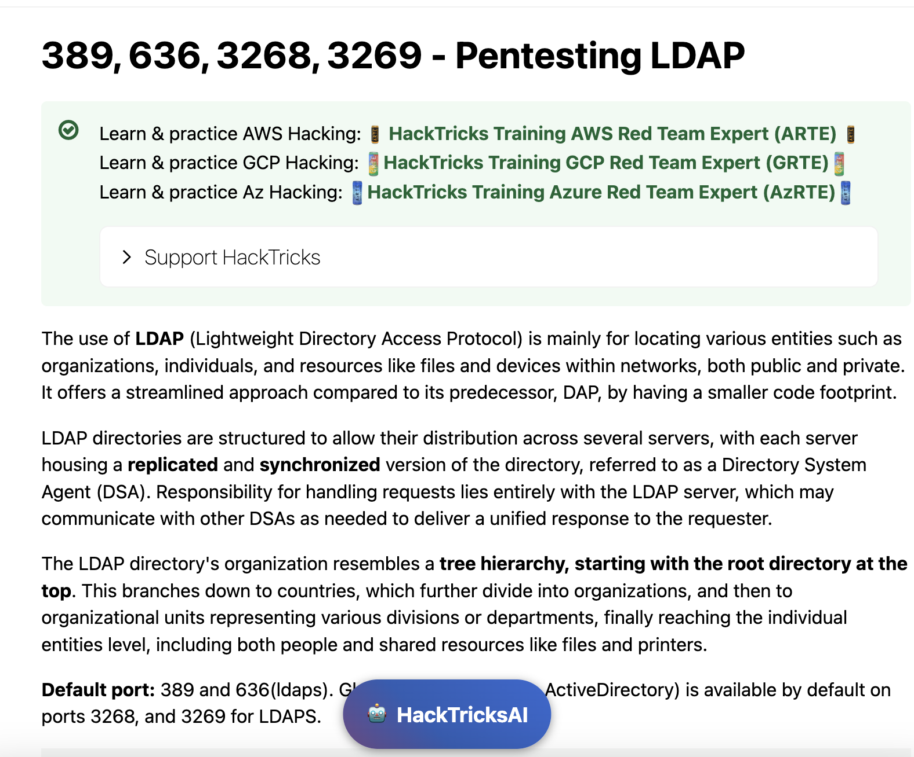  

>有domain看看是不是域名
>

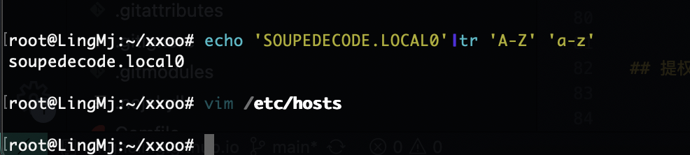  
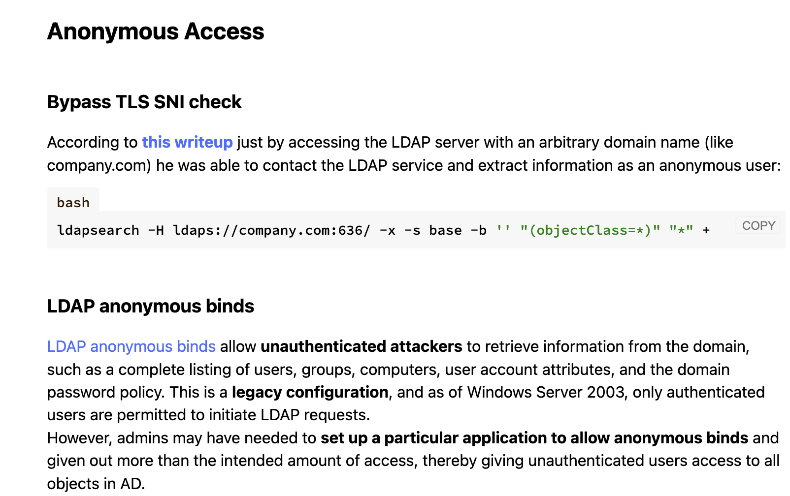  
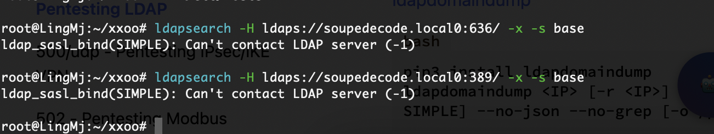  
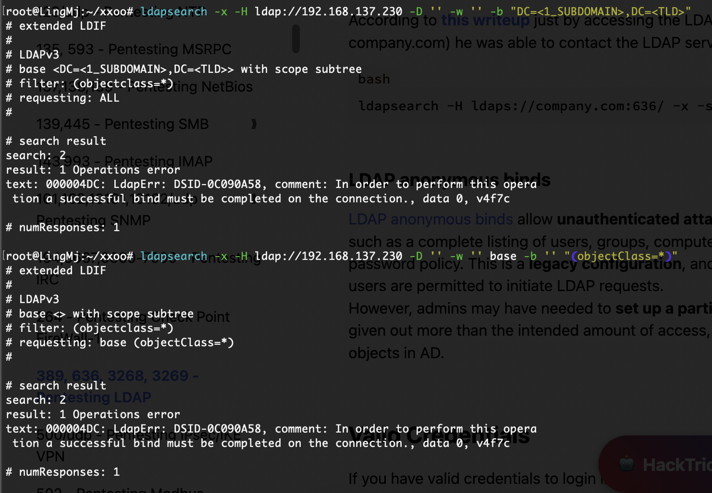  
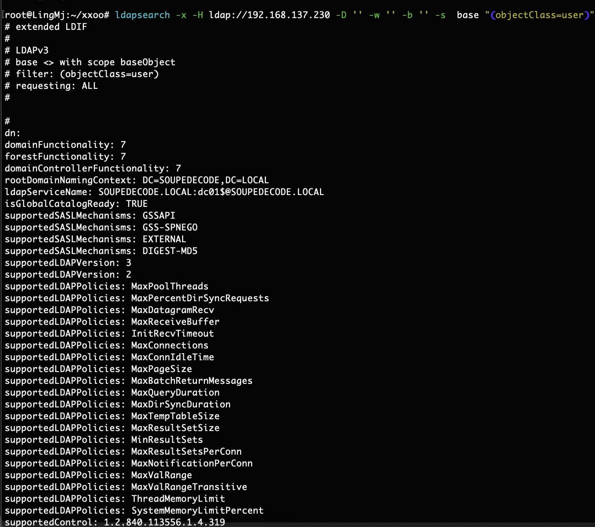  

>有东西了,具体看云看这篇文章：https://medium.com/@gokulg.me/introduction-92199491c808
>

```
# extended LDIF
#
# LDAPv3
# base <> with scope baseObject
# filter: (objectClass=user)
# requesting: ALL
#

#
dn:
domainFunctionality: 7
forestFunctionality: 7
domainControllerFunctionality: 7
rootDomainNamingContext: DC=SOUPEDECODE,DC=LOCAL
ldapServiceName: SOUPEDECODE.LOCAL:dc01$@SOUPEDECODE.LOCAL
isGlobalCatalogReady: TRUE
supportedSASLMechanisms: GSSAPI
supportedSASLMechanisms: GSS-SPNEGO
supportedSASLMechanisms: EXTERNAL
supportedSASLMechanisms: DIGEST-MD5
supportedLDAPVersion: 3
supportedLDAPVersion: 2
supportedLDAPPolicies: MaxPoolThreads
supportedLDAPPolicies: MaxPercentDirSyncRequests
supportedLDAPPolicies: MaxDatagramRecv
supportedLDAPPolicies: MaxReceiveBuffer
supportedLDAPPolicies: InitRecvTimeout
supportedLDAPPolicies: MaxConnections
supportedLDAPPolicies: MaxConnIdleTime
supportedLDAPPolicies: MaxPageSize
supportedLDAPPolicies: MaxBatchReturnMessages
supportedLDAPPolicies: MaxQueryDuration
supportedLDAPPolicies: MaxDirSyncDuration
supportedLDAPPolicies: MaxTempTableSize
supportedLDAPPolicies: MaxResultSetSize
supportedLDAPPolicies: MinResultSets
supportedLDAPPolicies: MaxResultSetsPerConn
supportedLDAPPolicies: MaxNotificationPerConn
supportedLDAPPolicies: MaxValRange
supportedLDAPPolicies: MaxValRangeTransitive
supportedLDAPPolicies: ThreadMemoryLimit
supportedLDAPPolicies: SystemMemoryLimitPercent
supportedControl: 1.2.840.113556.1.4.319
supportedControl: 1.2.840.113556.1.4.801
supportedControl: 1.2.840.113556.1.4.473
supportedControl: 1.2.840.113556.1.4.528
supportedControl: 1.2.840.113556.1.4.417
supportedControl: 1.2.840.113556.1.4.619
supportedControl: 1.2.840.113556.1.4.841
supportedControl: 1.2.840.113556.1.4.529
supportedControl: 1.2.840.113556.1.4.805
supportedControl: 1.2.840.113556.1.4.521
supportedControl: 1.2.840.113556.1.4.970
supportedControl: 1.2.840.113556.1.4.1338
supportedControl: 1.2.840.113556.1.4.474
supportedControl: 1.2.840.113556.1.4.1339
supportedControl: 1.2.840.113556.1.4.1340
supportedControl: 1.2.840.113556.1.4.1413
supportedControl: 2.16.840.1.113730.3.4.9
supportedControl: 2.16.840.1.113730.3.4.10
supportedControl: 1.2.840.113556.1.4.1504
supportedControl: 1.2.840.113556.1.4.1852
supportedControl: 1.2.840.113556.1.4.802
supportedControl: 1.2.840.113556.1.4.1907
supportedControl: 1.2.840.113556.1.4.1948
supportedControl: 1.2.840.113556.1.4.1974
supportedControl: 1.2.840.113556.1.4.1341
supportedControl: 1.2.840.113556.1.4.2026
supportedControl: 1.2.840.113556.1.4.2064
supportedControl: 1.2.840.113556.1.4.2065
supportedControl: 1.2.840.113556.1.4.2066
supportedControl: 1.2.840.113556.1.4.2090
supportedControl: 1.2.840.113556.1.4.2205
supportedControl: 1.2.840.113556.1.4.2204
supportedControl: 1.2.840.113556.1.4.2206
supportedControl: 1.2.840.113556.1.4.2211
supportedControl: 1.2.840.113556.1.4.2239
supportedControl: 1.2.840.113556.1.4.2255
supportedControl: 1.2.840.113556.1.4.2256
supportedControl: 1.2.840.113556.1.4.2309
supportedControl: 1.2.840.113556.1.4.2330
supportedControl: 1.2.840.113556.1.4.2354
supportedCapabilities: 1.2.840.113556.1.4.800
supportedCapabilities: 1.2.840.113556.1.4.1670
supportedCapabilities: 1.2.840.113556.1.4.1791
supportedCapabilities: 1.2.840.113556.1.4.1935
supportedCapabilities: 1.2.840.113556.1.4.2080
supportedCapabilities: 1.2.840.113556.1.4.2237
subschemaSubentry: CN=Aggregate,CN=Schema,CN=Configuration,DC=SOUPEDECODE,DC=L
 OCAL
serverName: CN=DC01,CN=Servers,CN=Default-First-Site-Name,CN=Sites,CN=Configur
 ation,DC=SOUPEDECODE,DC=LOCAL
schemaNamingContext: CN=Schema,CN=Configuration,DC=SOUPEDECODE,DC=LOCAL
namingContexts: DC=SOUPEDECODE,DC=LOCAL
namingContexts: CN=Configuration,DC=SOUPEDECODE,DC=LOCAL
namingContexts: CN=Schema,CN=Configuration,DC=SOUPEDECODE,DC=LOCAL
namingContexts: DC=DomainDnsZones,DC=SOUPEDECODE,DC=LOCAL
namingContexts: DC=ForestDnsZones,DC=SOUPEDECODE,DC=LOCAL
isSynchronized: TRUE
highestCommittedUSN: 159771
dsServiceName: CN=NTDS Settings,CN=DC01,CN=Servers,CN=Default-First-Site-Name,
 CN=Sites,CN=Configuration,DC=SOUPEDECODE,DC=LOCAL
dnsHostName: DC01.SOUPEDECODE.LOCAL
defaultNamingContext: DC=SOUPEDECODE,DC=LOCAL
currentTime: 20250731191324.0Z
configurationNamingContext: CN=Configuration,DC=SOUPEDECODE,DC=LOCAL

# search result
search: 2
result: 0 Success

# numResponses: 2
# numEntries: 1
```

>可以看到我域名写错了
>

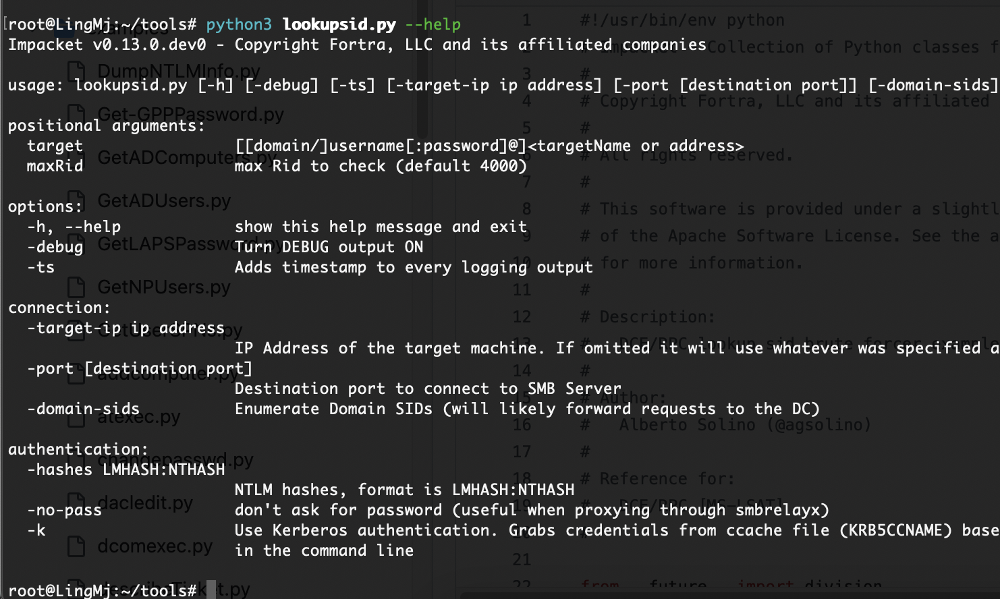  

>使用工具找一下信息
>

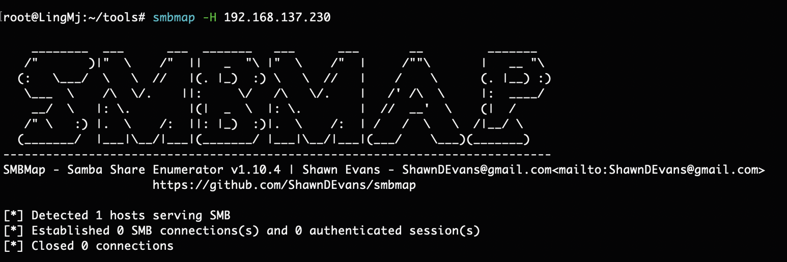  

>还是没有smb的信息
>

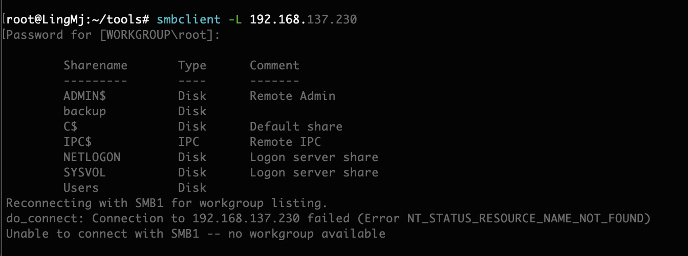  

>用map不行client又行了
>

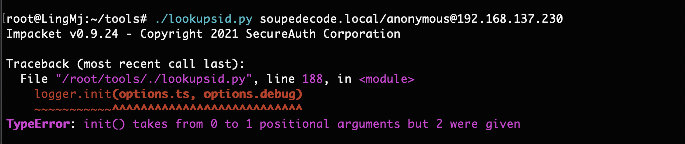  

>现在问题是这个
>

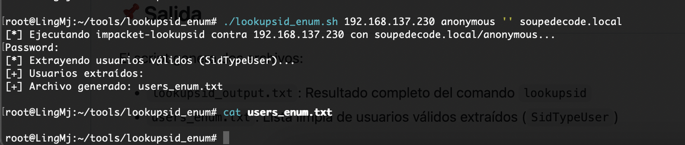  

>这个没拿出来
>

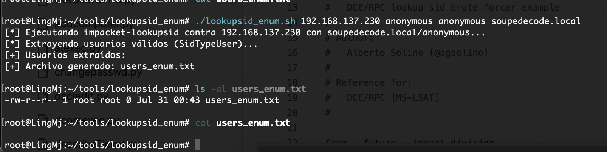  
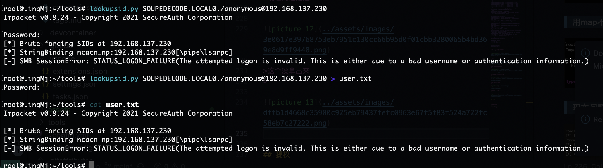  
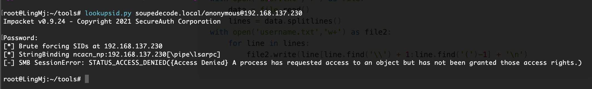  
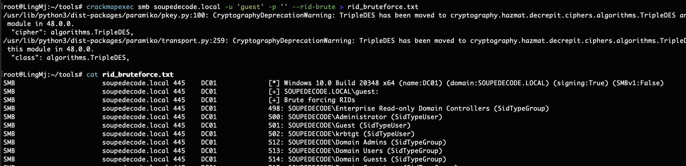  

>最后利用这个获取登录信息
>

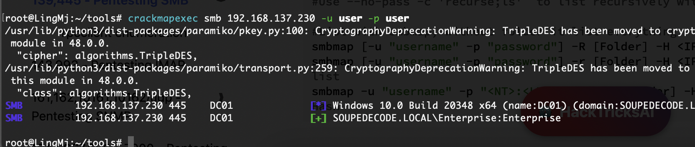  
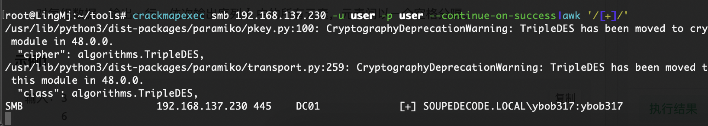  

>出东西了
>

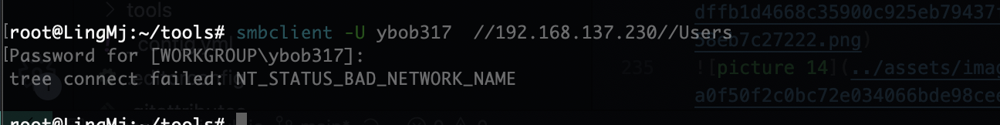  
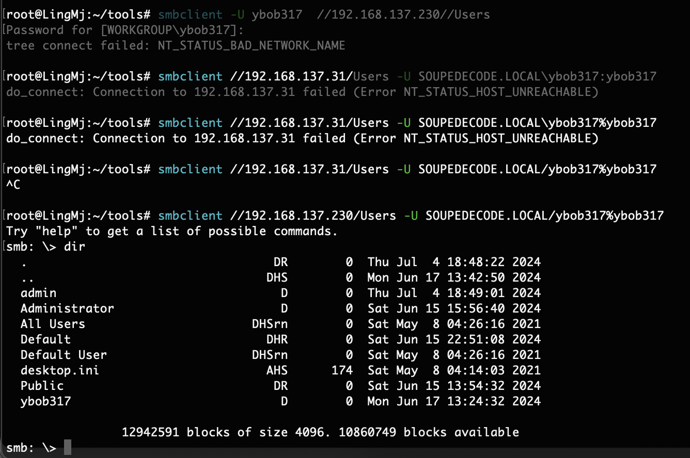  

>进去了
>

## 提权

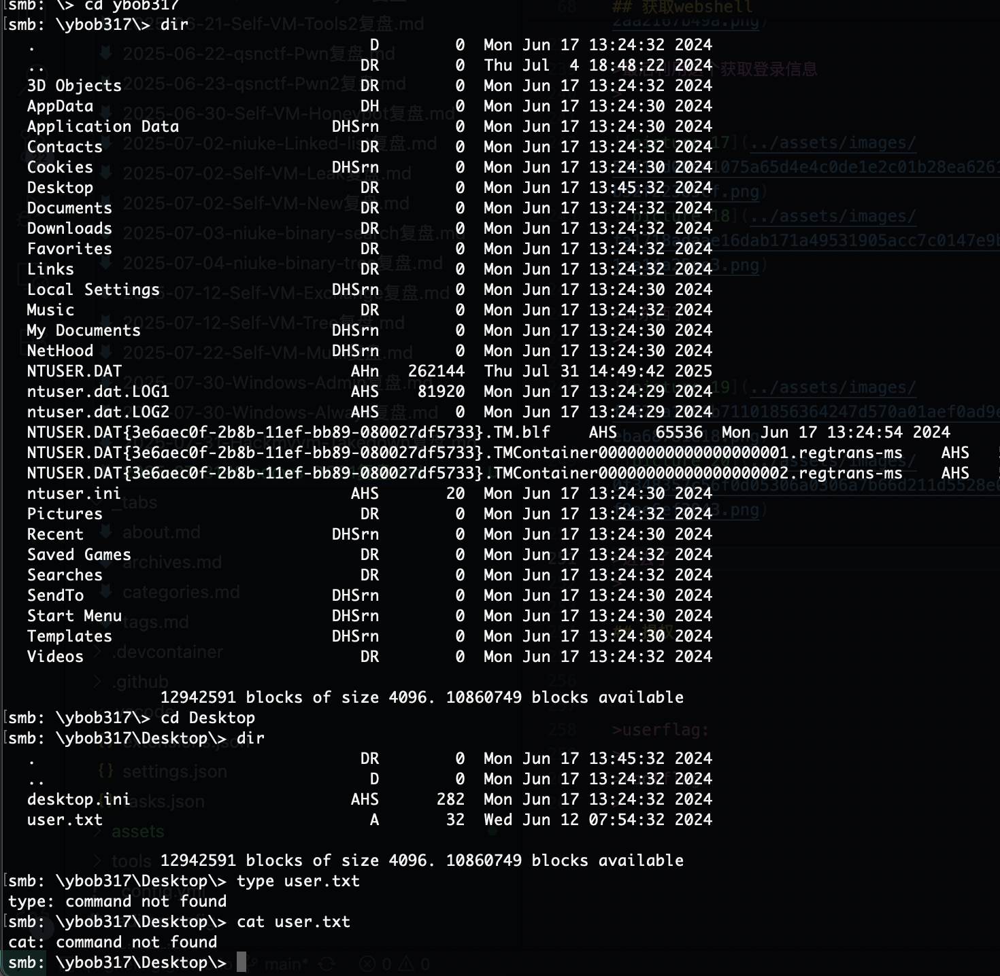  

>看了还是smb的问题应该上传东西getshell
>

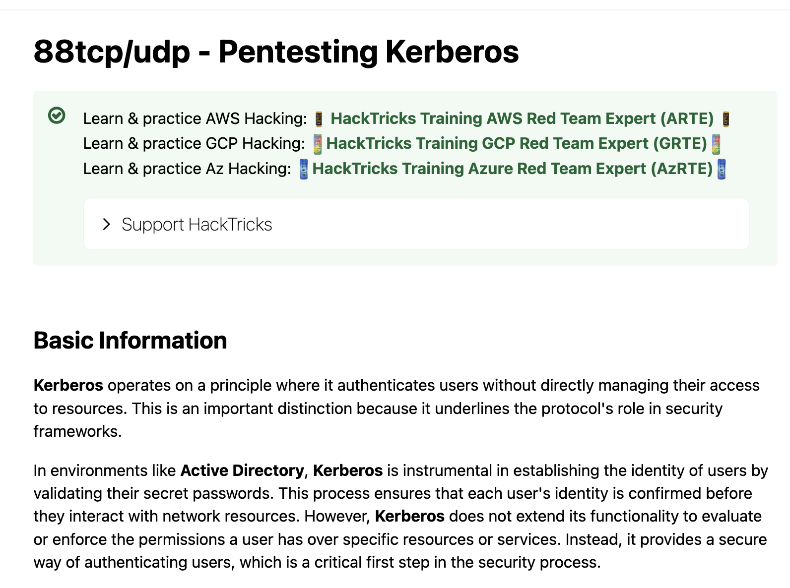  
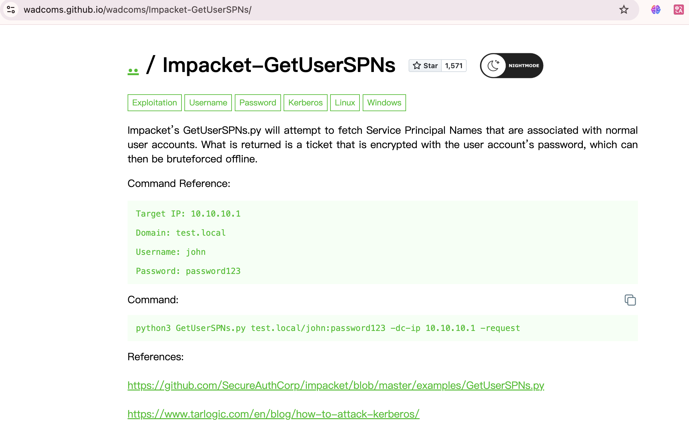  

>找到了个工具帮我
>

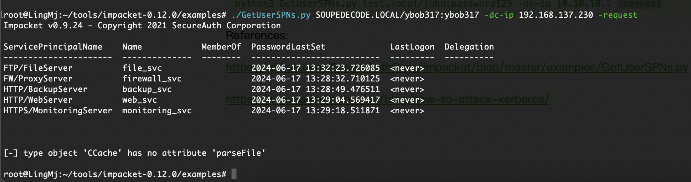  
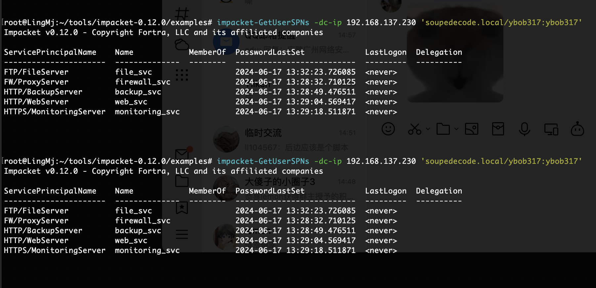  

>没有东西，看了wp这里会存在hash，我尝试重装靶机看看
>

>userflag:
>
>rootflag:
>